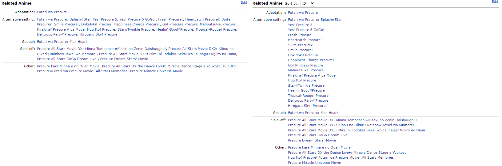
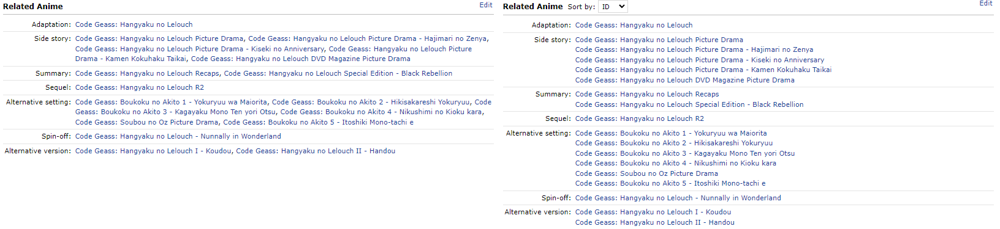
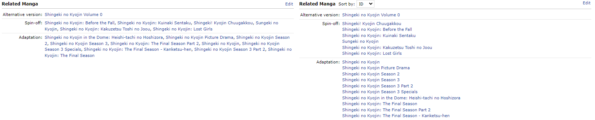
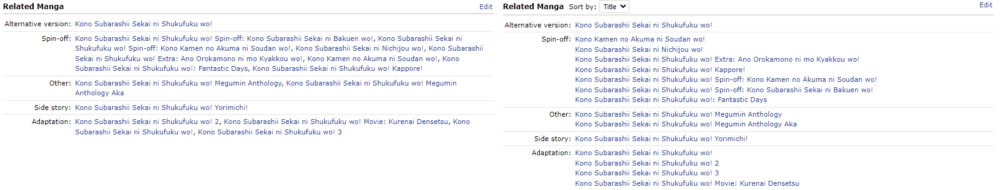

# MAL Better Related Entries

A Chrome browser extension for [MyAnimeList](https://myanimelist.net/). The extension improves the readability of the related section for Anime and Manga by separating the entries of each relation via a line break, instead of a comma. It also adds the ability to sort the entries inside the same relation by ID and Title.

## Comparison Original (left) and Extension (right):

[Pretty Cure](https://myanimelist.net/anime/603/Futari_wa_Precure):

[Code Geass: Lelouch of the Rebellion](https://myanimelist.net/anime/1575/Code_Geass__Hangyaku_no_Lelouch):

[Attack on Titan (Manga)](https://myanimelist.net/manga/23390/Shingeki_no_Kyojin):

[Konosuba: God's Blessing on This Wonderful World! (Light Novel)](https://myanimelist.net/manga/60553/Kono_Subarashii_Sekai_ni_Shukufuku_wo):

